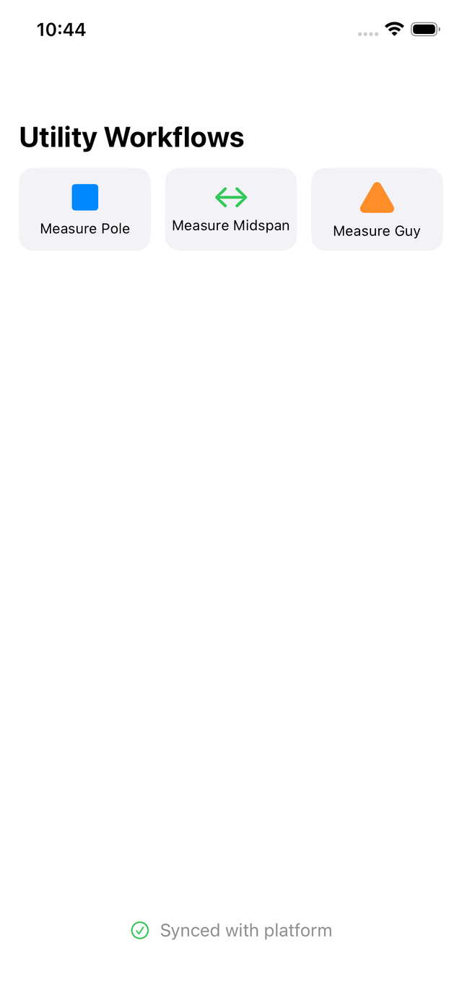
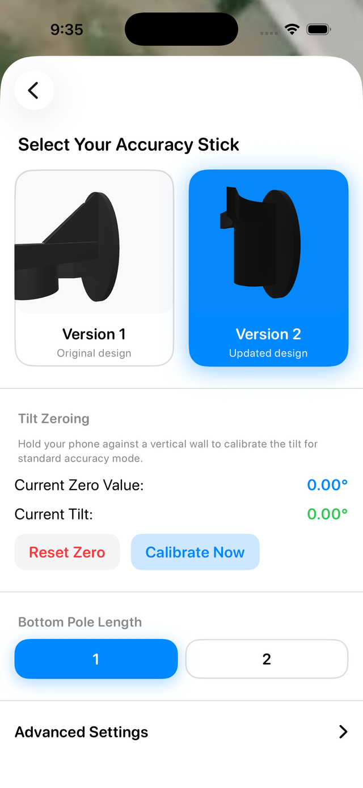
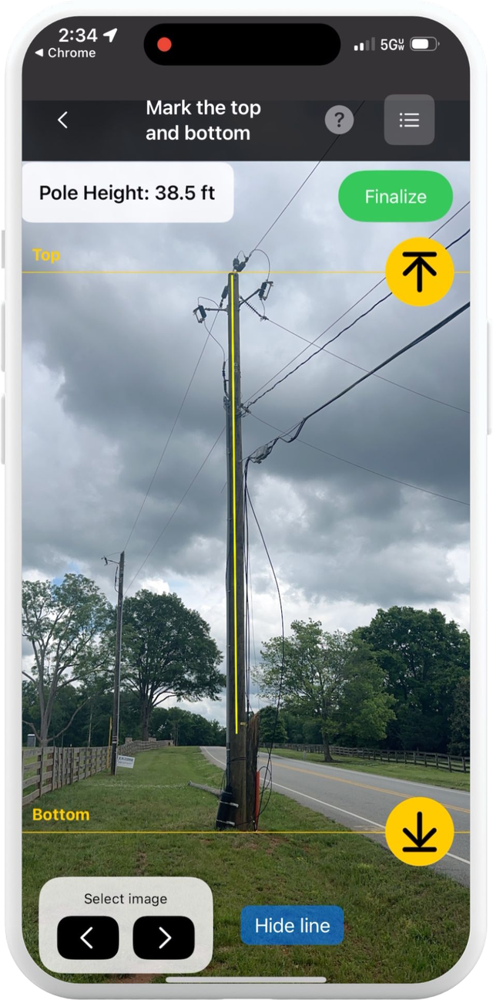
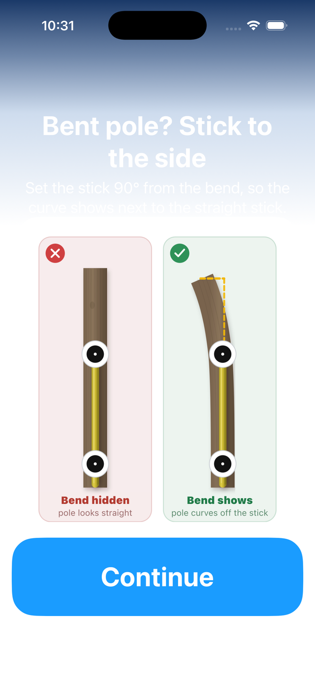
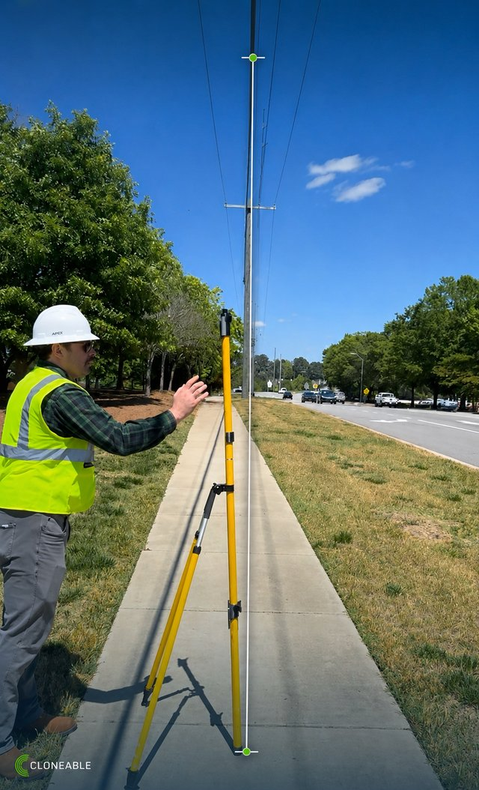
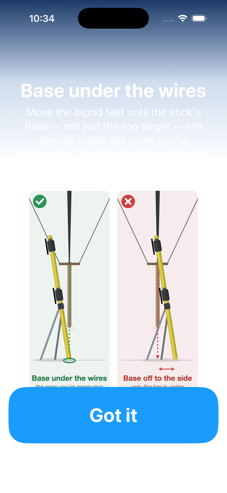
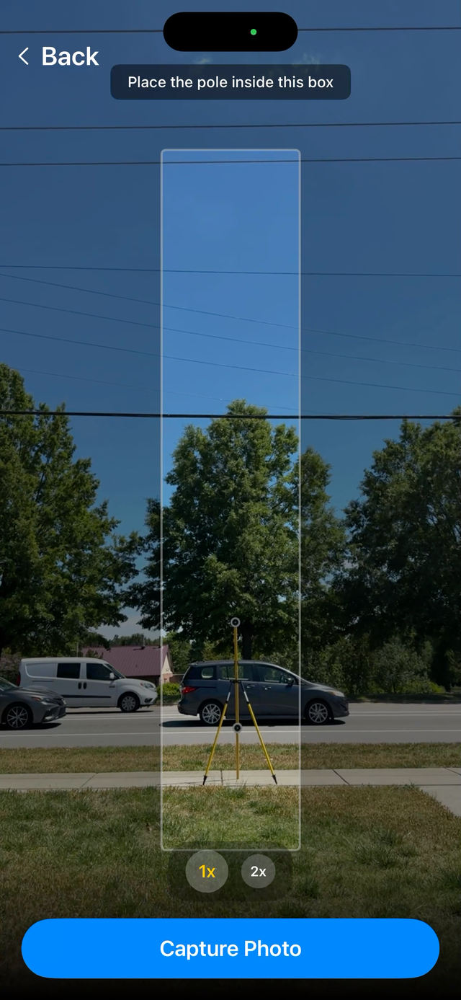

# Cloneable iOS SDK example app

A small SwiftUI app that shows how to integrate the [Cloneable iOS SDK](https://github.com/Cloneable-Inc/Cloneable-iOS-SDK) and launch its utility measurement workflows: measuring a pole, measuring a midspan clearance, and measuring a guy wire. It is the companion to the [SDK documentation](https://docs.cloneable.ai/cloneable-documentation/ios-sdk/introduction).

<p>
  
  
  
</p>

## What the app demonstrates

- Creating one `CloneablePlatform` instance, authenticating with an API key, and passing it through the view hierarchy as an environment object.
- Wrapping the app UI in `CloneableWorkflowWrapper` so the SDK can take over rendering while a workflow runs.
- Starting the utility workflows from plain SwiftUI buttons:
  - `startVerticalMeasurement(config:)` with a `VerticalMeasurementConfiguration` of type `.pole` or `.midspan`, in `.highAccuracy` (with the Cloneable accuracy stick) or `.standardAccuracy` mode.
  - `startGuyWorkflow()` for guy wires.
- Supplying your own inventory options to a workflow: pole attachment classes, wire classes, guy wire sizes, owner names, and whether the attachments stage runs at all.
- Registering custom components (a logical `CountComponent` and a `PdfViewComponent` UI component) so they can be used from Cloneable workflows.
- Showing sync status and the SDK settings sheet.

## The workflows

The measurement stages use the camera and ARKit, so they only run on a physical iPhone Pro; the simulator can show the setup screens but not the capture stages.

### Measure a pole

`VerticalMeasurementConfiguration(type: .pole, accuracy: .highAccuracy, ...)`

The fielder picks the accuracy stick version and zeroes the phone's tilt, places the stick on the pole, frames the pole and stick in the guided capture view, and marks the top and bottom of the pole. The result comes back as `CloneableJSON`, for example `result["pole_information"]["height"]`. High accuracy mode scales the photo from the stick's two targets; standard mode is AR only.

<p>
  
  
  
</p>

### Measure a midspan

`VerticalMeasurementConfiguration(type: .midspan, accuracy: .highAccuracy, ...)`

For a clearance under the wires the stick goes on the ground directly beneath the conductors, and the workflow measures the height of each wire above it. Standard mode covers the case where the stick cannot be set on the road.

<p>
  
  
  
</p>

### Measure a guy

`startGuyWorkflow()`

A guy is added from a measured pole. The workflow records the guy's lead length and angle from the pole, suggests angles (perpendicular to the line, opposite the span pull), and lets the fielder correct either value before saving.

### Training videos

Short field-training walkthroughs of each workflow on a real pole:

- [High-accuracy pole measurement](https://help.cloneable.ai/en/articles/16380360-high-accuracy-pole-measurement)
- [High-accuracy pole measurement from two known points](https://help.cloneable.ai/en/articles/16380358-high-accuracy-pole-measurement-from-two-known-points)
- [High-accuracy midspan measurement](https://help.cloneable.ai/en/articles/16380359-high-accuracy-midspan-measurement)
- [Set up your accuracy stick](https://help.cloneable.ai/en/articles/16380661-set-up-your-accuracy-stick)

## Requirements

- Xcode 15 or later, Swift 5.9 or later
- iOS 17 or later
- A Cloneable account and an API key
- A physical iPhone Pro (LiDAR) to run the measurement stages

## Getting started

1. Clone the repository:

   ```sh
   git clone https://github.com/Cloneable-Inc/Cloneable-Example-iOS-App.git
   ```

2. Open `cloneable-example-app.xcodeproj` in Xcode and wait for Swift Package Manager to resolve `Cloneable-iOS-SDK`. The binary package is about 1 GB, so the first resolve takes a while.
3. Select your team under **Signing & Capabilities**.
4. Create an API key at [app.cloneable.ai/settings/api-keys](https://app.cloneable.ai/settings/api-keys) and paste it into `YOUR_API_KEY` in `cloneable-example-app/cloneable_example_app.swift`.
5. Optionally set a Roboflow API key with `CloneablePlatform.setRoboflowAPIKey(_:)` before the platform is created to enable on-device attachment and scale-target detection.
6. Build and run on your iPhone.

## How the integration works

Create the platform once and hand it to the view tree:

```swift
@StateObject private var cloneable = CloneablePlatform(authType: .api, apiKey: YOUR_API_KEY)

var body: some Scene {
    WindowGroup {
        ContentView().environmentObject(cloneable)
    }
}
```

Wrap the UI the SDK is allowed to take over, then start a workflow from any button:

```swift
CloneableWorkflowWrapper(cloneablePlatform: cloneable) {
    Button("Measure Pole") {
        Task {
            let config = VerticalMeasurementConfiguration(
                type: .pole,
                accuracy: .highAccuracy,
                inventoryClasses: nil,
                wireClasses: nil,
                guyWireOptions: nil,
                ownerOptions: ["City Electric"],
                shouldCaptureAttachments: true
            )
            let result = try await cloneable.startVerticalMeasurement(config: config)
            print(result["pole_information"]["height"].numberValue ?? 0)
        }
    }
}
```

`ContentView.swift` has the full set of examples, including custom inventory, wire and guy wire option lists and a configuration that skips the attachments stage.

## Documentation

- [Cloneable iOS SDK docs](https://docs.cloneable.ai/cloneable-documentation/ios-sdk/introduction): setup, [starting workflows](https://docs.cloneable.ai/cloneable-documentation/ios-sdk/utility-measurement-workflows/starting-workflows), [configuration](https://docs.cloneable.ai/cloneable-documentation/ios-sdk/utility-measurement-workflows/configuration) and the [data output structure](https://docs.cloneable.ai/cloneable-documentation/ios-sdk/utility-measurement-workflows/data-output-structure).
- [Help center](https://help.cloneable.ai): field guides for [measuring a pole](https://help.cloneable.ai/en/articles/16312637-measure-a-pole), [measuring a midspan](https://help.cloneable.ai/en/articles/16380662-measure-a-midspan-high-accuracy) and [guy wires](https://help.cloneable.ai/en/articles/16312640-guy-wires-correcting-one-or-measuring-one).

## Contributing

Pull requests and issues are welcome.

## License

This project is licensed under the MIT License.

---

For more information, visit [Cloneable.ai](https://cloneable.ai).
